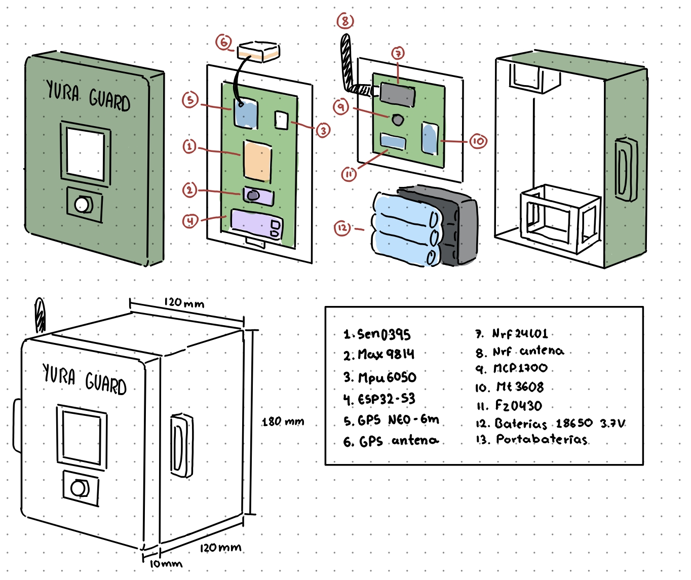
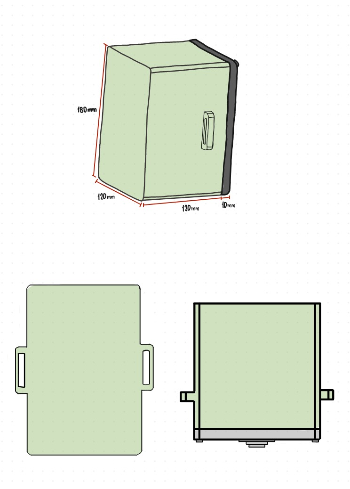

# YURA GUARD - Bocetos

## Descripción

Bocetos del diseño del dispositivo YURA GUARD.

---

## Boceto 1: Vista Isométrica

---

## Boceto 2: Vistas Ortogonales

---

## Dimensiones

- **Alto:** 180 mm
- **Ancho:** 120 mm
- **Profundidad:** 120 mm
- **Espesor de la tapa :** 10 mm
