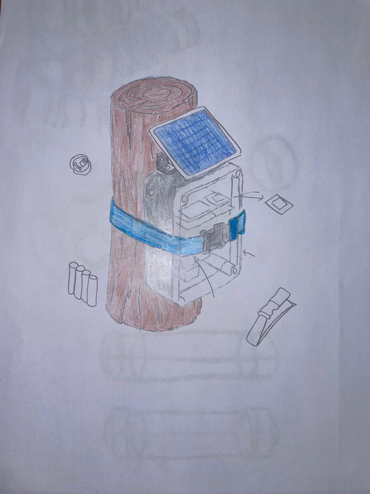
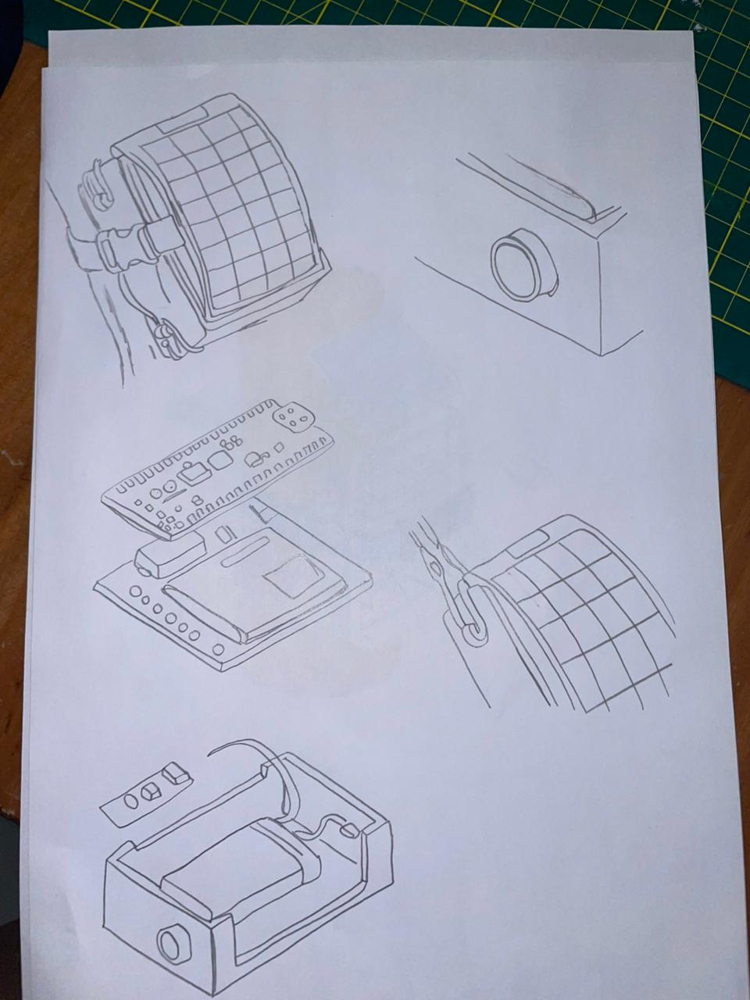
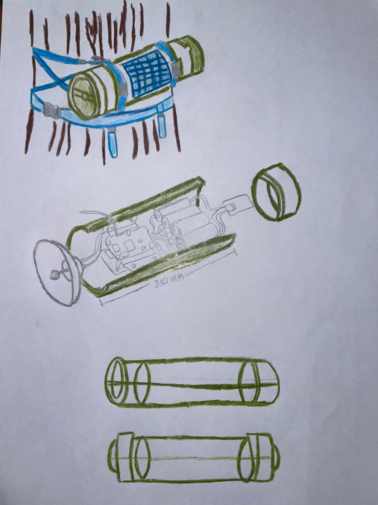

# Bocetos - YURA GUARD

## Descripción

Bocetos conceptuales del dispositivo YURA GUARD para la detección de tala ilegal en la Amazonía peruana.

---

## Boceto 1

Concepto con diseño modular, carcasa protectora impresa en 3D y fijación al árbol mediante correa de nylon. Incluye compartimento interno para almacenamiento de energía y sistema de captación solar.

---

## Boceto 2

Concepto con panel solar rígido en la parte superior para captar energía. Fijación al tronco con correa de nylon y almacenamiento energético mediante celdas recargables.

---

## Boceto 3

Concepto completo con panel solar inclinado, carcasa protectora y sistema de sujeción al árbol. Incluye módulo de comunicación para transmisión de datos y notificación remota de alertas.

---

**Grupo 9 | UPCH - 2026**
